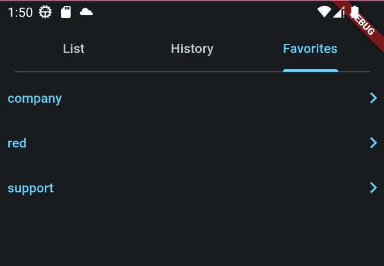

# Coodesh Dictionary

> This is a challenge by Coodesh

## About

This project consists of a simple dictionary, showing a grid of words that, when open, present the user with the IPA and meanings for the selected word.
The user can hear the pronunciation of a word and also save the word as a favorite.

## Screenshots
List|Word|Word Detail|History|Favorites
:-------------------------:|:--------------------------:|:-------------------------:|:-------------------------:|:-------------------------:
 |  |   |  | 

## Technical Details
### Architecture

The code was organized using the [Clean Architecture](https://blog.cleancoder.com/uncle-bob/2012/08/13/the-clean-architecture.html) Pages are layered as such:

- modules folder
    - *feature* folder
        - *presentation* file (The UI)
        - *data* folder (External)
            - *data source* file (Requests for external data, apis and databases)
        - *domain* folder (Internal)
            - *repository* file (Translation from the view to the external and the external source to the view)
            - *usecase* files (Contracts for requests, what should be send and what is expected to be received)

### Dependencies
The folowing dependencies were used:
- [http](https://pub.dev/packages/http) Dart base request library.
    - For the simplicity of the project, only dart's own library was used for requests, [dio](https://pub.dev/packages/dio) could be an upgrade for more complex requests.
- [collection](https://api.dart.dev/stable/3.1.1/dart-collection/dart-collection-library.html) Dart base collection library
    - For expanded use of maps and lists
- [dartz](https://pub.dev/packages/dartz) Functional programming.
    - Used for flexibility on api responses.
- [get_it](https://pub.dev/packages/get_it) Dependency Injection.
- [flutter_tts](https://pub.dev/packages/flutter_tts) Text to speech plugin.
    - Working offline it is a upgrade from getting tts from an API
- [flutter_dotenv](https://pub.dev/packages/flutter_dotenv) Environment configuration loader
- [hive](https://pub.dev/packages/hive) Lightweight NOSql database for Dart.
    - Can save full objects, future based & very fast.

### Building
The next steps assume you have:
- The [Android Toolchain](https://developer.android.com/tools) and [Android Studio](https://developer.android.com/studio) installed and updated.
- [Flutter](https://docs.flutter.dev/get-started/install) installed and updated, the project version is 3.12.1.
- [Git](https://git-scm.com/) installed and updated.
- Have an API key for the [WordsAPI](https://rapidapi.com/dpventures/api/wordsapi)

1. Clone this repository
2. When downloaded run the following commands on the root of the project:
    - `flutter pub get`
    - `dart run build_runner build --delete-conflicting-outputs`
    - `dart .\create_env.dart --key API_KEY` 
        - Where API_KEY is *your* key for the words API, no quotation marks. eg `dart .\create_env.dart --key ABcdEF12345`
    - `flutter run`
